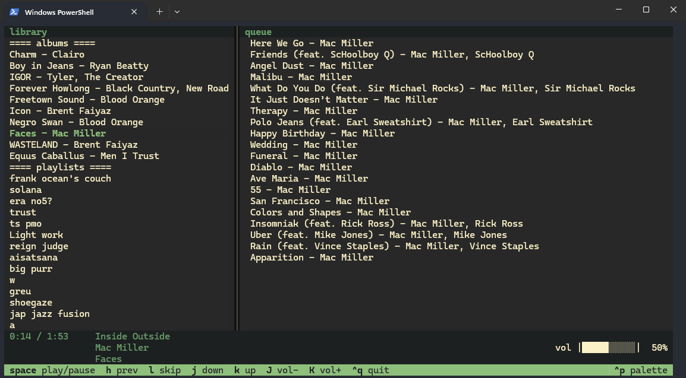

# spotify-tui

A terminal-based Spotify client built with [Textual](https://github.com/Textualize/textual) and [Spotipy](https://github.com/spotipy-dev/spotipy). Requires an active Spotify Premium account.



---

## requirements

- Python 3.10+
- A Spotify Premium account
- A Spotify developer app (for API credentials)
- Have Spotify installed on your computer

---

## setup

### 1. clone the repo

```bash
git clone https://github.com/cristian-alexutan/cli-sp.git
cd cli-sp
```

### 2. install dependencies

Using a virtual environment is recommended. You can create one with:
```bash
python -m venv venv
source venv/bin/activate  # on Windows: venv\Scripts\activate
```

Then, install the required packages with:

```bash
pip install -r requirements.txt
```

### 3. create a Spotify developer app

Go to [developer.spotify.com/dashboard](https://developer.spotify.com/dashboard), create an app, and add a redirect URI (e.g. `http://localhost:8888/callback`).

### 4. configure environment variables

Create a `.env` file in the project root, following the format of `.env.example`.

---

## running

```bash
python -m cli-sp
```

On first run, a browser window will open asking you to authorize the app. After that, a `.cache` file will store your token locally.

---

## keybindings

| key | action |
|-----|--------|
| `space` | play / pause |
| `h` | previous track |
| `l` | skip track |
| `j` / `k` | navigate library |
| `J` / `K` | volume down / up |
| `enter` | play selected album or playlist |
| `^q` | quit |

---

## notes

Albums play in order. Playlists play shuffled.